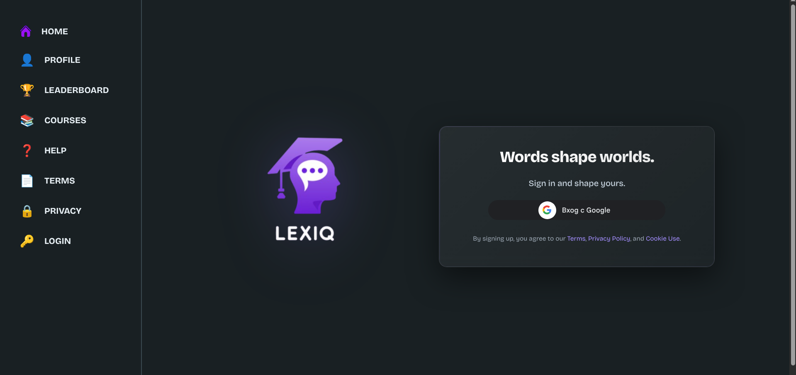
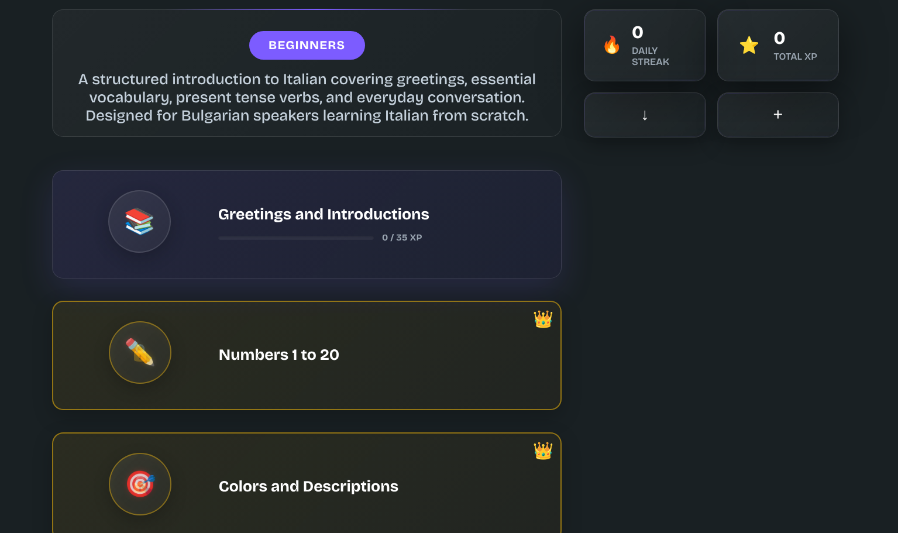
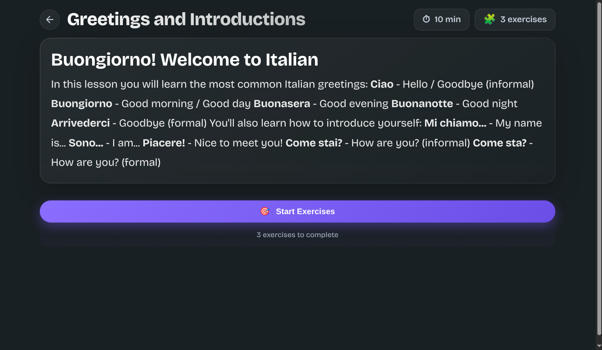
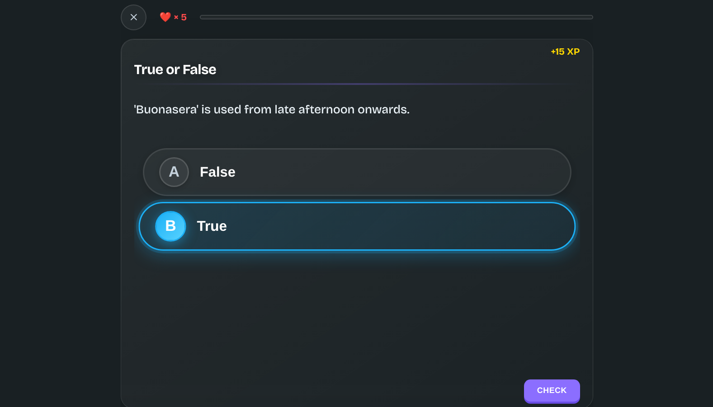
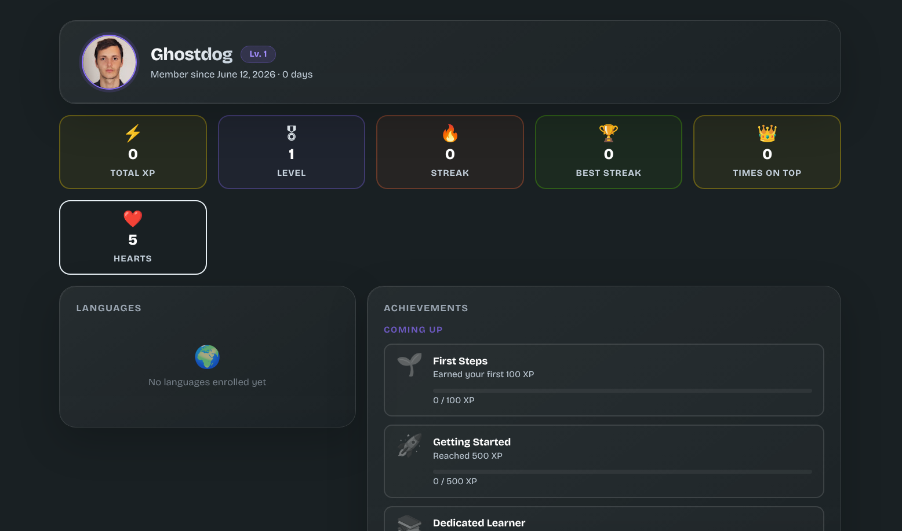

# Lexiq

[](https://dotnet.microsoft.com/)
[](https://angular.io/)
[](https://www.typescriptlang.org/)
[](https://www.docker.com/)
[](https://github.com/features/actions)
[](https://www.cloudflare.com/)
[](LICENSE)

A full-stack language learning platform for Bulgarian speakers studying Italian. Built as both a functional application and a technical showcase — demonstrating production-grade engineering across frontend, backend, infrastructure, and DevOps.

**Live**: [relexiq.com](https://relexiq.com)

### Highlights

- Production app deployed on Hetzner Cloud, served through Cloudflare with zero open ports on the server
- Full CI/CD pipeline: automated Docker builds, test suite (unit → integration → E2E), and zero-downtime deploys on every push to `master`
- Two-layer caching: Cloudflare edge cache for static assets + in-process API cache — origin server only contacted when needed
- JWT authentication via HttpOnly cookie — token never exposed to JavaScript
- Gamification system: XP, levels, streaks, hearts, and a real-time leaderboard with rank change tracking
- Polymorphic exercise engine with 5 exercise types under a single database table (Table-Per-Hierarchy)
- Role-based access control enforced independently at both API and route-guard level
- Rich lesson editor built on Editor.js, integrated as an Angular `ControlValueAccessor`

---

## Screenshots

| Login | Course list | Lesson viewer |
|:-----:|:-----------:|:-------------:|
|  |  |  |

| Exercise | Profile & gamification |
|:--------:|:---------------------:|
|  |  |

---

---

## Tech Stack

### Backend

| Component | Technology | Version |
|-----------|------------|---------|
| Framework | ASP.NET Core Web API | 10.0 |
| ORM | Entity Framework Core | 10.0 |
| Database | Microsoft SQL Server | 2022 |
| Caching | ASP.NET Core IMemoryCache | — |
| Authentication | Google OAuth 2.0 + JWT HS256 (HttpOnly cookie) | — |
| Identity | ASP.NET Core Identity | — |
| Language | C# | 13.0 |
| Test framework | xUnit v3 + Testcontainers | — |

### Frontend

| Component | Technology | Version |
|-----------|------------|---------|
| Framework | Angular (standalone components) | 21 |
| Language | TypeScript | 5.7 |
| Reactive primitives | RxJS | 7.8 |
| Forms | Angular Reactive Forms (typed) | — |
| Rich text editor | Editor.js (ControlValueAccessor wrapper) | 2.x |
| Styling | SCSS / Glassmorphism design system | — |

### Infrastructure

| Component | Technology |
|-----------|------------|
| Hosting | Hetzner Cloud VPS |
| Provisioning | Terraform + Ansible (external) |
| Containerisation | Docker Compose (dev + prod configs) |
| Image registry | GitHub Container Registry (`ghcr.io`) |
| Reverse proxy | nginx (unprivileged, plain HTTP only) |
| TLS & edge security | Cloudflare (Tunnel, Zero Trust, DDoS, Bot, Edge Cache) |
| CI/CD | GitHub Actions (5 reusable workflows) |
| Security scanning | GitHub CodeQL (C# + TypeScript) |
| Deployment | Bash (`deploy.sh` + `verify-deployment.sh`) |

---

## Architecture

Lexiq is a three-tier application: an Angular 21 SPA served by nginx, an ASP.NET Core 10 Web API, and a SQL Server 2022 database — all containerised via Docker Compose and deployed to Hetzner Cloud.

All inbound traffic is routed through a **Cloudflare Tunnel**. TLS is terminated at the Cloudflare edge — the server never handles certificates or exposes ports. nginx acts as a reverse proxy inside the Docker network, forwarding plain HTTP from `cloudflared` to the appropriate container.

```
Browser → Cloudflare Edge (TLS, DDoS, WAF, Edge Cache)
        → cloudflared (Cloudflare Tunnel)
        → nginx (Docker, plain HTTP :80)
        → backend:8080  /  frontend static files
```

### Content Model

The curriculum follows a four-level hierarchy: **Language → Course → Lesson → Exercise**.

Exercises use **Table-Per-Hierarchy (TPH)** — a single `Exercises` table with a discriminator column covering five concrete types: `FillInBlank`, `Listening`, `TrueFalse`, `ImageChoice`, and `AudioMatching`. Each type uses `[JsonPolymorphic]` with a `type` discriminator as the first JSON property, enabling clean round-trip serialisation without custom converters.

Lesson access is gated per user: each account has its own `UserLessonProgress` row with an `IsLocked` flag, updated independently as the user progresses through the curriculum.

### Authentication

The frontend initiates the Google OAuth flow, receives an ID token, and POSTs it to `/api/auth/google-login`. The backend validates the token via `GoogleJsonWebSignature.ValidateAsync()`, creates the user record if needed, and issues a signed JWT (HS256) stored in an **HttpOnly, SameSite=Lax cookie** named `AuthToken`. The token is never exposed to JavaScript.

A custom `UserContextMiddleware` pre-loads the full `User` entity into `HttpContext.Items` on every authenticated request — controllers call `HttpContext.GetCurrentUser()` with no redundant DB lookups per request.

### Role-Based Access Control

Three-tier role hierarchy — **Admin**, **ContentCreator**, **User** — enforced at both layers:

- **Backend**: `[Authorize(Roles = "...")]` on controllers. Mutation endpoints require Admin or ContentCreator; public read endpoints are anonymous.
- **Frontend**: Functional Angular route guards (`authGuard`, `noAuthGuard`, `contentGuard`) mirror backend permissions without a round-trip. Unauthorised users cannot reach protected routes; manually constructed API requests are rejected by the backend independently.

### Gamification

- **XP** — earned for correct submissions. `User.TotalPointsEarned` is a materialised cache incremented on first correct answer; time-windowed leaderboard queries use explicit SQL `JOIN` + `GROUP BY` over raw progress records.
- **Levels** — `floor((1 + sqrt(1 + xp/25)) / 2)`, computed server-side.
- **Streaks** — distinct UTC calendar days with at least one exercise completed, counted backward from today.
- **Hearts** — 5 per user, decremented on wrong answers. Refill: +1 per 4-hour window since first loss, max 5. Admins and ContentCreators bypass the system.
- **Leaderboard rank change** — computed stateless by comparing current-period XP against the equivalent prior period. No snapshot tables required.

### Lesson Editor

Lessons are authored through a dynamic block-based editor built on **Editor.js**, wrapped as an Angular `ControlValueAccessor` so it integrates seamlessly with Reactive Forms. Content creators compose rich lesson material from text paragraphs, images, documents, PDFs, and audio files. Files are stored server-side with GUID filenames and a 1-year `max-age` cache header. A 300ms debounce on `onChange` prevents redundant saves during active editing.

### Key Design Decisions

| Decision | Rationale |
|----------|-----------|
| JWT in HttpOnly cookie | Prevents XSS token theft. SameSite=Lax works via nginx proxying `/api` same-origin from the browser's perspective |
| Cloudflare Tunnel (no open ports) | Zero public attack surface on the server. TLS, DDoS, and bot protection handled at the edge without server configuration |
| Cloudflare Zero Trust SSH | GitHub Actions connects without an open SSH port — credentials are Cloudflare service tokens, not static keys on the public internet |
| Docker secrets | Sensitive values (`DB_PASSWORD`, `JWT_SECRET`, `GOOGLE_CLIENT_SECRET`) are mounted as files under `/run/secrets`, never injected as environment variables |
| UserContextMiddleware | Amortises the User DB lookup to once per request. All controllers read from `HttpContext.Items` |
| TPH for exercises | Single table, EF Core handles polymorphic eager loading via cast-based `ThenInclude((e as FillInBlankExercise)!.Options)` |
| Explicit JOIN before GroupBy | EF Core wraps navigation properties inside `GroupBy` in `TransparentIdentifier<>`, breaking SQL translation. Leaderboard queries flatten to scalar columns via `.Join()` first |
| Data-protection keys volume | Keys are in a named Docker volume, not bound to a container. 90-day Cloudflare cert rotation cannot invalidate them |
| Per-user lesson unlock | `UserLessonProgress.IsLocked` tracks unlock state per account, not per lesson — supporting multiple users at different points in the curriculum independently |

---

## Infrastructure & Deployment

### Hetzner Cloud

The production server is a Hetzner Cloud VPS. Initial provisioning — OS hardening, user setup, Docker installation, firewall rules, and the `cloudflared` systemd service — was handled with **Terraform** and **Ansible** outside this repository. Ongoing deployments are fully automated via GitHub Actions.

### Docker Compose

Two compose configurations ship in the repository:

| File | Purpose |
|------|---------|
| `docker-compose.yml` | Local development — builds images from source, exposes all ports |
| `docker-compose.prod.yml` | Production — pulls pre-built images from GHCR, uses Docker secrets, structured health checks, log rotation |

Production compose highlights:
- **Docker secrets** for `db_password` and `backend_env` — mounted as files under `/run/secrets`, not environment variables
- **Named volumes** for `db-data`, `backend-uploads`, and `backend-dataprotection` — survive container restarts and redeploys
- **Health checks** on all three services with `depends_on: condition: service_healthy` — containers start in dependency order
- **Log rotation** — `max-size: 10m`, `max-file: 3` on all services
- Backend and database containers are not port-mapped — accessible only within the Docker bridge network

### Cloudflare

| Service | Role |
|---------|------|
| **Cloudflare Tunnel** | Routes all inbound HTTP/S traffic to the server. TLS terminated at the edge — no certificates on the server |
| **Zero Trust Access** | SSH access for deployment. GitHub Actions authenticates with `CF_ACCESS_CLIENT_ID` + `CF_ACCESS_CLIENT_SECRET` service tokens via `cloudflared access ssh` — no SSH port is open on the server |
| **Edge cache** | Static assets (JS, CSS, fonts, images) cached at the nearest Cloudflare PoP with a 1-year immutable TTL. Angular's content-hashed filenames make this safe — a new deploy produces new filenames, busting the cache automatically |
| **DDoS protection** | L3/L4/L7 DDoS mitigation and rate limiting at the Cloudflare edge |
| **Bot management** | Cloudflare bot protection filters automated traffic before it reaches the origin |
| **DNS** | Authoritative DNS with Cloudflare proxy enabled |

### Performance & Caching

Lexiq uses a two-layer caching strategy to minimise origin load and keep response times low:

**Cloudflare edge cache (static assets)**

All hashed build artefacts — JS bundles, CSS, fonts, images — are served directly from the nearest Cloudflare PoP with a 1-year immutable TTL. The origin server is never contacted for a cached asset. nginx sets `Cache-Control: public, immutable` on these files; a Cloudflare cache rule enforces the 1-year edge TTL regardless of origin headers.

**IMemoryCache (API responses)**

Course and lesson data changes rarely. `CourseService` and `LessonService` cache query results in ASP.NET Core's `IMemoryCache` with a 24-hour sliding expiration. Mutation endpoints evict the relevant cache entries immediately so reads always see current data.

```
Browser (repeat visit)
  └── Cloudflare edge cache  ← JS/CSS/fonts/images served here; origin not touched

Browser (API call)
  └── nginx → backend
                └── IMemoryCache hit  ← courses/lessons served from memory
                └── IMemoryCache miss → SQL Server → cache populated
```

| Layer | Scope | Survives restart | Invalidation |
|-------|-------|:---:|---|
| Cloudflare edge | Static assets | Yes | Content-hash filename change on deploy |
| IMemoryCache | API responses (courses, lessons) | No | Explicit `Remove()` on mutation; container restart |

### Deployment Script (`scripts/deploy.sh`)

A structured Bash deployment script with production-grade reliability:

- `set -eEuo pipefail` — strict error handling; any failure aborts and triggers the error trap
- **IP redaction** — all log output passes through `mask_ips()`, replacing IPv4 addresses with `[REDACTED_IP]`
- **GitHub Actions annotations** — `::group::`, `::error::`, `::warning::`, `::notice::` for structured CI output
- **DB password validation** — validates SQL Server password policy before attempting deployment
- **Typed exit codes** — `2` secrets invalid, `3` registry auth/pull failed, `4` container start failed
- **Persistent logs** — written to `/var/log/lexiq/deployment/deploy-<timestamp>.log` on the server
- `docker compose up -d --wait` — waits for all health checks to pass before reporting success

A companion `scripts/verify-deployment.sh` runs post-deploy health checks and logs a structured summary.

---

## CI/CD Pipeline

The pipeline is built from five reusable GitHub Actions workflows with clear stage gates.

### On every pull request → `master`

```
build-frontend ──┐
                 ├── run-tests (unit → integration → controllers → E2E)
build-backend  ──┘
```

- Both Docker images are built and validated with layer caching (`type=gha`). Images are **not** pushed.
- The full backend test suite runs only after both builds pass.
- Dependabot PRs that pass tests are auto-approved and squash-merged.

### On push to `master` (release)

```
build-and-push ──── pull-and-test ──── test-backend ──── continuous-delivery
```

1. **Build & push** — Docker images built and pushed to `ghcr.io` with multi-tag strategy: branch name, `git-sha` prefix, semver (`v1.2.3`, `1.2`), and `latest` on default branch.
2. **Pull & test** — freshly pushed images are pulled from GHCR to verify registry integrity before deployment proceeds.
3. **Test** — full backend test suite runs again against the release commit.
4. **Deploy** — SSH via Cloudflare Zero Trust; deployment scripts and `docker-compose.prod.yml` are SCP'd to the server, then `deploy.sh` and `verify-deployment.sh` execute remotely.

### Backend test stages (`test.yml` — reusable)

| Stage | Filter | Requires Docker |
|-------|--------|:---:|
| Unit | `Tests.Unit` | No |
| Integration — Services | `Tests.Integration.Services` | Yes (Testcontainers) |
| Integration — Controllers | `Tests.Integration.Controllers` | Yes (Testcontainers) |
| E2E | `Tests.Integration.E2E` | Yes (WebApplicationFactory) |

Each stage uploads a `.trx` results artifact (retained 30 days). Integration and E2E stages spin up a real SQL Server 2022 container via Testcontainers — no in-memory fakes.

### Automated dependency updates (Dependabot)

Dependabot runs every Monday and opens grouped PRs for all package ecosystems:

| Ecosystem | Directory |
|-----------|-----------|
| Docker base images | `/frontend`, `/backend` |
| npm | `/frontend` |
| NuGet | `/backend` |
| GitHub Actions | `/` |

Minor, patch, and major updates are grouped into a single PR per ecosystem. Dependabot PRs that pass the full test suite are **automatically approved and squash-merged**.

### CodeQL security scanning

GitHub's CodeQL scans both C# (manual build) and TypeScript (auto) on every push, every PR, and on a weekly schedule. Results surface as GitHub Security alerts.

---

## Getting Started

### Prerequisites

- [Docker](https://docs.docker.com/get-docker/) and Docker Compose
- [.NET 10 SDK](https://dotnet.microsoft.com/download) — local backend development only
- [Node.js 20+](https://nodejs.org/) — local frontend development only
- A Google Cloud project with OAuth 2.0 credentials

### Google OAuth Setup

**1. Create a project and configure the consent screen**

Open [Google Cloud Console](https://console.cloud.google.com/) and create or select a project. Navigate to **APIs & Services → OAuth consent screen**:
- User type: **External**
- Fill in app name, support email, and developer contact email
- Add scopes: `openid`, `email`, `profile`
- Add your own Google account as a **test user** while in testing mode

**2. Create OAuth 2.0 credentials**

Navigate to **APIs & Services → Credentials → Create Credentials → OAuth 2.0 Client ID**:
- Application type: **Web application**
- **Authorised JavaScript origins**: `http://localhost:4200`
- **Authorised redirect URIs**: `http://localhost:4200`

Copy the **Client ID** and **Client Secret**.

### Environment Variables

Create `backend/.env`:

```env
DB_SERVER=db
DB_NAME=LexiqDb
DB_USER_ID=sa
DB_PASSWORD=YourStrongPassword123!

GOOGLE_CLIENT_ID=your-client-id.apps.googleusercontent.com
GOOGLE_CLIENT_SECRET=your-client-secret

JWT_SECRET=a-random-string-of-at-least-32-characters
JWT_EXPIRATION_HOURS=24
```

Create `backend/Database/password.txt` (must match `DB_PASSWORD`):

```
YourStrongPassword123!
```

> Generate a secure `JWT_SECRET` with: `openssl rand -base64 32`

### Run with Docker

```bash
git clone https://github.com/Ghostdog02/Lexiq.git
cd Lexiq
docker compose up --build
```

| Service | URL |
|---------|-----|
| Frontend | http://localhost:4200 |
| Backend API | http://localhost:8080 |
| Swagger UI | http://localhost:8080/swagger |

The backend runs EF Core migrations automatically on startup, retrying with exponential backoff until SQL Server is ready.

### Local Development

**Backend** — from `backend/`:

```bash
dotnet restore
dotnet watch run        # port 8080, reloads on save
```

```bash
# Database migrations
dotnet ef migrations add <Name> --project Database/Backend.Database.csproj
dotnet ef database update --project Database/Backend.Database.csproj
```

**Frontend** — from `frontend/`:

```bash
npm install
npm start              # port 4200, proxies /api/* → localhost:8080
```

---

## Running Tests

Backend tests use **xUnit v3** with **Testcontainers** — a real SQL Server 2022 instance spins up in Docker per test run. Docker must be running.

```bash
cd backend

# Full suite
dotnet test Tests/Backend.Tests.csproj --logger "console;verbosity=normal"

# Unit tests only (no Docker required)
dotnet test Tests/Backend.Tests.csproj --filter "FullyQualifiedName~Tests.Unit"

# Single class
dotnet test Tests/Backend.Tests.csproj --filter "FullyQualifiedName~GetLeaderboardTests"
```

| Directory | Contents |
|-----------|----------|
| `Tests/Services/` | Unit tests (`CalculateLevel`) and service integration tests (`GetStreak`, `GetLeaderboard`) |
| `Tests/Controllers/` | Controller integration tests via `WebApplicationFactory` |
| `Tests/E2E/` | End-to-end flow tests against a full in-process server |
| `Tests/Builders/` | Fluent `UserBuilder` — creates test users directly via `DbContext`, bypassing `UserManager` |
| `Tests/Infrastructure/` | `DatabaseFixture` — manages Testcontainers lifecycle and per-test data seeding |
| `Tests/Helpers/` | `DbSeeder` — seeds the minimum schema required by each test class |

---

## API Reference

Full interactive documentation available at `http://localhost:8080/swagger`.

### Authentication

| Method | Endpoint | Description | Auth |
|--------|----------|-------------|------|
| POST | `/api/auth/google-login` | Validate Google ID token, issue JWT cookie | Public |
| POST | `/api/auth/logout` | Clear the `AuthToken` cookie | Yes |
| GET | `/api/auth/auth-status` | Returns authenticated state | Yes |
| GET | `/api/auth/is-admin` | Returns role info (`isAdmin`, `roles[]`) | Yes |

### Courses

| Method | Endpoint | Description | Auth |
|--------|----------|-------------|------|
| GET | `/api/courses` | List all courses | Public |
| GET | `/api/courses/{id}` | Course detail with lessons | Public |
| POST | `/api/courses` | Create course | Admin / ContentCreator |
| PUT | `/api/courses/{id}` | Update course | Admin / ContentCreator |
| DELETE | `/api/courses/{id}` | Delete course | Admin / ContentCreator |

### Lessons

| Method | Endpoint | Description | Auth |
|--------|----------|-------------|------|
| GET | `/api/lessons/{id}` | Lesson detail with exercises | Yes |
| GET | `/api/lessons/course/{courseId}` | All lessons for a course | Yes |
| GET | `/api/lessons/{id}/exercises` | Exercises for a lesson | Yes |
| GET | `/api/lessons/{id}/progress` | Lesson progress summary | Yes |
| GET | `/api/lessons/{id}/submissions` | Exercise submission history | Yes |
| GET | `/api/lessons/{id}/next` | Next lesson in the course | Yes |
| POST | `/api/lessons/{id}/submit` | Batch-submit all lesson answers | Yes |
| POST | `/api/lessons/{id}/unlock` | Force-unlock a lesson | Admin |
| POST | `/api/lessons` | Create lesson | Admin / ContentCreator |
| PUT | `/api/lessons/{id}` | Update lesson | Admin / ContentCreator |
| DELETE | `/api/lessons/{id}` | Delete lesson | Admin / ContentCreator |

### Exercises

| Method | Endpoint | Description | Auth |
|--------|----------|-------------|------|
| GET | `/api/exercises/{id}` | Exercise detail | Yes |
| GET | `/api/exercises/{id}/correct-answer` | Correct answer for an exercise | Yes |
| POST | `/api/exercises/{id}/submit` | Submit a single exercise answer | Yes |
| POST | `/api/exercises` | Create exercise | Admin / ContentCreator |
| PUT | `/api/exercises/{id}` | Update exercise | Admin / ContentCreator |
| DELETE | `/api/exercises/{id}` | Delete exercise | Admin / ContentCreator |

### Leaderboard & User

| Method | Endpoint | Description | Auth |
|--------|----------|-------------|------|
| GET | `/api/leaderboard?timeFrame=Weekly\|Monthly\|AllTime` | Ranked leaderboard with XP, level, streak, rank change | Public |
| GET | `/api/user/xp` | Authenticated user's total XP | Yes |
| GET | `/api/user/hearts` | Authenticated user's current heart count and refill timer | Yes |
| GET | `/api/user/{id}/xp` | Any user's total XP | Public |
| GET | `/api/user/{id}/avatar` | User avatar image | Public |
| PUT | `/api/user/avatar` | Upload a new avatar | Yes |

### Languages & User Languages

| Method | Endpoint | Description | Auth |
|--------|----------|-------------|------|
| GET | `/api/languages` | List all languages | Public |
| POST | `/api/languages` | Create language | Admin |
| PUT | `/api/languages/{id}` | Update language | Admin |
| DELETE | `/api/languages/{id}` | Delete language | Admin |
| GET | `/api/userLanguages` | Languages enrolled by the current user | Yes |
| POST | `/api/userLanguages` | Enrol in a language | Yes |
| DELETE | `/api/userLanguages/{id}` | Leave a language | Yes |

### Administration

| Method | Endpoint | Description | Auth |
|--------|----------|-------------|------|
| GET | `/api/userManagement` | List all users | Admin |
| GET | `/api/userManagement/{id}` | User detail | Admin |
| DELETE | `/api/userManagement/{id}` | Delete user | Admin |
| GET | `/api/roleManagement` | List roles and assignments | Admin |
| POST | `/api/roleManagement/assign` | Assign role to user | Admin |
| DELETE | `/api/roleManagement/revoke` | Revoke role from user | Admin |

### Uploads

| Method | Endpoint | Description | Auth |
|--------|----------|-------------|------|
| POST | `/api/uploads/{fileType}` | Upload a file (image, audio, document) | Yes |
| POST | `/api/uploads/any` | Upload a file of any type | Yes |
| POST | `/api/uploads/{fileType}-by-url` | Fetch and store a file from a URL | Yes |
| GET | `/api/uploads/{fileType}/{filename}` | Retrieve a file by type and name | Yes |
| GET | `/api/uploads/{filename}` | Retrieve a file by name | Yes |
| GET | `/api/uploads/list/{fileType}` | List uploaded files by type | Yes |
| GET | `/api/uploads/list/all` | List all uploaded files | Yes |

---

## Project Structure

```
Lexiq/
├── backend/
│   ├── Controllers/          # HTTP layer — thin, delegates directly to services
│   ├── Services/             # Business logic: auth, lessons, leaderboard, progress, avatars, uploads
│   ├── Database/
│   │   ├── Entities/         # EF Core models — TPH exercise hierarchy, ASP.NET Core Identity users
│   │   ├── Migrations/       # EF Core migration history
│   │   └── Extensions/       # Seed data and migration retry helpers
│   ├── Dtos/                 # Request/response contracts (C# record types)
│   ├── Mapping/              # Entity ↔ DTO extension methods
│   ├── Middleware/           # UserContextMiddleware: JWT → full User entity per request
│   ├── Extensions/           # Service registration and middleware pipeline setup
│   ├── Tests/                # xUnit v3 + Testcontainers — unit, integration, controller, E2E
│   └── Program.cs
├── frontend/
│   └── src/app/
│       ├── auth/             # AuthService (BehaviorSubject), Google login, functional route guards
│       ├── features/
│       │   ├── lessons/      # Course/lesson/exercise views, lesson editor, ExerciseViewerStateService
│       │   └── users/        # User profile, leaderboard
│       ├── shared/           # Editor.js ControlValueAccessor, SCSS design system
│       └── nav-bar/
├── .github/
│   └── workflows/
│       ├── pr-validation.yml         # PR gate: build both images + full test suite
│       ├── release.yml               # Push to master: build → push → pull-verify → test → deploy
│       ├── build-and-push-docker.yml # Reusable: build & push frontend + backend to ghcr.io
│       ├── continuous-delivery.yml   # Reusable: SSH via Cloudflare Zero Trust → deploy.sh
│       ├── test.yml                  # Reusable: unit → integration → controllers → E2E
│       └── codeql.yml                # CodeQL security scanning (C# + TypeScript)
├── scripts/
│   ├── deploy.sh             # Structured deployment: IP redaction, exit codes, password validation
│   └── verify-deployment.sh  # Post-deploy health verification
├── docker-compose.yml        # Local development
└── docker-compose.prod.yml   # Production: Docker secrets, health checks, log rotation
```

---

## License

Copyright 2026 Alexander

Licensed under the Apache License, Version 2.0. See [LICENSE](LICENSE) for details.
